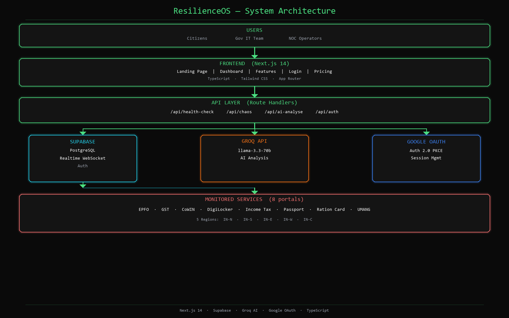

# ResilienceOS

> **India's first real-time government digital infrastructure monitoring platform.**

[](https://nextjs.org)
[](https://typescriptlang.org)
[](https://supabase.com)
[](https://groq.com)
[](LICENSE)

ResilienceOS monitors 8 critical government portals across 5 regional nodes in real time — detecting outages in under 15 seconds, generating AI-powered incident reports via Groq, and guiding citizens to fallback services when portals go down.

**Live:** [resos-jwwd.onrender.com](https://resos-jwwd.onrender.com)



---

## The Problem

India has **800M+ internet users** who depend on government digital services daily — EPFO, GST Portal, CoWIN, DigiLocker, Income Tax, Passport, and more. But:

- No unified real-time monitoring system exists for India's government portals
- Outages are discovered **hours later** via Twitter complaints, not dashboards
- NIC manages **1,000+ portals** — none have a public real-time status page
- IT downtime costs **₹50 lakh+ per hour** for critical government services

---

## Features

| Feature | Description |
|---|---|
| **Real-Time Monitoring** | Tracks uptime %, latency ms, and status for 8 services across 5 regions |
| **15s Auto-Refresh** | Dual mechanism: Supabase Realtime WebSocket + 15-second polling fallback |
| **AI Incident Analyst** | One-click Groq-powered report: root cause, severity, resolution steps, ETA |
| **Chaos Lab** | Inject failures on-demand to test monitoring, alerts, and fallback routes |
| **Fallback Routes** | When a service is down, citizens are shown alternative access methods |
| **Regional Health** | Sidebar anomaly counts per region (IN-N/S/E/W/C) with hover tooltip breakdown |
| **Incident Feed** | Live severity-tracked incident log with resolution status |
| **Google OAuth** | Secure login via Google, PKCE flow, session managed by Supabase |

---

## Tech Stack

```
Frontend       Next.js 16 (App Router) · TypeScript · Tailwind CSS
Backend        Supabase (PostgreSQL + Realtime WebSockets)
Auth           Google OAuth 2.0 via Supabase (PKCE flow)
AI             Groq API — llama-3.3-70b-versatile
Charts         Recharts (AreaChart with dark theme)
Carousel       Embla Carousel React
Icons          Lucide React
Animation      Framer Motion
Deployment     Netlify / Render
```

---

## Project Structure

```
src/
├── app/
│   ├── page.tsx                  # Landing page (canvas trail, TextScramble, live stats)
│   ├── dashboard/page.tsx        # Main monitoring dashboard
│   ├── features/page.tsx         # Feature showcase with bento grid + carousel
│   ├── login/page.tsx            # Google OAuth + email/password login
│   ├── pricing/page.tsx          # Pricing tiers (Free / Pro / Enterprise)
│   ├── status/page.tsx           # Public status page
│   ├── auth/callback/page.tsx    # OAuth PKCE callback handler
│   └── api/
│       ├── health-check/         # Pings all 8 services, writes to Supabase
│       ├── chaos/                # Inject / restore / restore-all service failures
│       ├── ai-analyse/           # Groq AI incident report generation
│       └── auth/                 # Session management helpers
├── components/
│   ├── ServiceCard.tsx           # Service status card with expand/collapse
│   ├── AIAnalysisModal.tsx       # Groq incident analysis overlay
│   ├── ChaosPanel.tsx            # Chaos engineering controls
│   ├── IncidentFeed.tsx          # Live incident list with severity badges
│   ├── GlassCategoryButton.tsx   # Liquid glass SVG feTurbulence filter buttons
│   ├── GlowCard.tsx              # Mouse-tracking spotlight hover stat cards
│   ├── TechCarousel.tsx          # Auto-scrolling tech + services carousel
│   ├── Features.tsx              # Bento-grid feature showcase with particles
│   ├── ShootingStars.tsx         # Multi-layer animated star background
│   ├── TextScramble.tsx          # Character randomize-then-settle animation
│   ├── WavePath.tsx              # Interactive SVG Q-bezier wave divider
│   ├── MarqueeAnimation.tsx      # Infinite bidirectional scroll banner
│   ├── HoverButton.tsx           # Configurable glow-effect CTA button
│   ├── Tooltip.tsx               # Radix UI tooltip, dark monospace style
│   └── ui/
│       ├── carousel.tsx          # Embla carousel (Carousel/Content/Item)
│       └── chart.tsx             # Recharts dark theme wrapper
└── lib/
    ├── supabase.ts               # Supabase client, getSession, signOut, signInWithGoogle
    ├── canvasTrail.ts            # Mouse particle trail (renderCanvas / destroyCanvas)
    ├── services.ts               # Service data helper functions
    └── auth.ts                   # Server-side auth utilities
```

---

## Database Schema

```sql
-- Services being monitored
CREATE TABLE services (
  id               uuid PRIMARY KEY DEFAULT gen_random_uuid(),
  name             text NOT NULL,
  category         text,          -- Finance | Identity | Health | Citizen | Welfare
  region           text,          -- IN-NORTH | IN-SOUTH | IN-EAST | IN-WEST | IN-CENTRAL
  status           text DEFAULT 'operational', -- operational | degraded | outage
  uptime_percent   float DEFAULT 100,
  latency_ms       integer DEFAULT 0,
  url              text,
  description      text,
  fallback_routes  jsonb,         -- [{ name: string, description: string }]
  last_checked     timestamptz,
  created_at       timestamptz DEFAULT now()
);

-- Incident log
CREATE TABLE incidents (
  id          uuid PRIMARY KEY DEFAULT gen_random_uuid(),
  service_id  uuid REFERENCES services(id),
  severity    text,              -- critical | high | medium | low
  message     text,
  resolved    boolean DEFAULT false,
  created_at  timestamptz DEFAULT now()
);

-- Health check history (used for latency chart + uptime calculation)
CREATE TABLE health_checks (
  id          uuid PRIMARY KEY DEFAULT gen_random_uuid(),
  service_id  uuid REFERENCES services(id),
  latency_ms  integer,
  status      text,
  checked_at  timestamptz DEFAULT now()
);
```

> Enable **Realtime** on all three tables in the Supabase dashboard.

---

## Getting Started

### Prerequisites

- Node.js 18+
- A [Supabase](https://supabase.com) project
- A [Groq](https://console.groq.com) API key
- A [Google Cloud](https://console.cloud.google.com) OAuth 2.0 Web Client

### 1. Clone & Install

```bash
git clone https://github.com/ROHITCRAFTSYT/Preksha.git
cd Preksha
npm install
```

### 2. Environment Variables

Create `.env.local` in the project root:

```env
NEXT_PUBLIC_SUPABASE_URL=https://your-project.supabase.co
NEXT_PUBLIC_SUPABASE_ANON_KEY=your-anon-key
SUPABASE_SERVICE_ROLE_KEY=your-service-role-key
GROQ_API_KEY=gsk_your-groq-api-key
GOOGLE_CLIENT_ID=your-google-client-id
GOOGLE_CLIENT_SECRET=your-google-client-secret
```

### 3. Set Up Supabase

1. Run the SQL schema above in the **SQL Editor**
2. Go to **Authentication → Providers** → Enable Google with your Client ID + Secret
3. Go to **Authentication → URL Configuration**:
   - **Site URL:** `http://localhost:3000` (change to your domain in production)
   - **Redirect URLs:** add `http://localhost:3000/auth/callback`
4. Enable **Realtime** on `services`, `incidents`, `health_checks` tables

### 4. Set Up Google OAuth

1. Go to [Google Cloud Console](https://console.cloud.google.com) → APIs & Services → Credentials
2. Create OAuth 2.0 Web Client
3. **Authorized redirect URIs:** `https://your-project.supabase.co/auth/v1/callback`

### 5. Seed Services

```sql
INSERT INTO services (name, category, region, status, uptime_percent, latency_ms, url, description, fallback_routes) VALUES
('EPFO Services',         'Finance',  'IN-CENTRAL', 'operational', 99.2, 320, 'https://www.epfindia.gov.in',      'Employee Provident Fund withdrawals, transfers, and balance', '[{"name":"EPFO Helpline","description":"1800-118-005 for PF assistance"},{"name":"UMANG PF Access","description":"Check PF via UMANG app"}]'),
('GST Portal',            'Finance',  'IN-CENTRAL', 'operational', 98.1, 410, 'https://www.gst.gov.in',           'GST filing, returns, and compliance management',              '[]'),
('CoWIN / Health Portal', 'Health',   'IN-SOUTH',   'operational', 97.5, 280, 'https://www.cowin.gov.in',         'Vaccine booking and health certificate services',             '[]'),
('DigiLocker',            'Identity', 'IN-EAST',    'operational', 99.7, 190, 'https://www.digilocker.gov.in',    'Digital document storage and verification',                   '[]'),
('Income Tax Portal',     'Finance',  'IN-NORTH',   'operational', 96.8, 360, 'https://www.incometax.gov.in',     'ITR filing, refunds, and tax compliance',                     '[]'),
('Passport Portal',       'Identity', 'IN-CENTRAL', 'operational', 98.9, 440, 'https://www.passportindia.gov.in', 'Passport application and status tracking',                    '[]'),
('Ration Card Portal',    'Welfare',  'IN-WEST',    'operational', 95.3, 520, 'https://nfsa.gov.in',              'National Food Security Act beneficiary management',            '[]'),
('UMANG App Services',    'Citizen',  'IN-SOUTH',   'operational', 97.1, 380, 'https://web.umang.gov.in',         'Unified Mobile Application for New-age Governance',           '[]');
```

### 6. Run Locally

```bash
npm run dev
```

Open [http://localhost:3000](http://localhost:3000)

---

## Deployment

### Netlify *(recommended)*

Connect your GitHub repo at [netlify.com](https://netlify.com/new). The included `netlify.toml` handles everything automatically.

```toml
[build]
  command = "npm run build"
  publish = ".next"

[[plugins]]
  package = "@netlify/plugin-nextjs"
```

Add all 6 environment variables in **Site Configuration → Environment Variables**, then trigger a redeploy.

### Render

1. New Web Service → Connect GitHub repo
2. Build command: `npm run build` · Start command: `npm start`
3. Add all env vars → Deploy

### Vercel

```bash
npm install -g vercel
vercel login
vercel --prod
```

> **After deploying:** update **Supabase Site URL**, **Redirect URLs**, and **Google OAuth authorized redirect URIs** to your production domain.

---

## API Reference

### `POST /api/health-check`
Pings all 8 services in parallel, records latency + status in `health_checks`, updates `services`, creates `incidents` on status changes.

### `POST /api/chaos`
```json
{ "serviceId": "uuid", "action": "inject" | "restore" | "restore-all" }
```
- `inject` — sets service to `outage`, uptime to 0, creates incident
- `restore` — resets service to `operational`, resolves incidents
- `restore-all` — restores every service at once

### `POST /api/ai-analyse`
```json
{
  "serviceId": "uuid",
  "serviceName": "EPFO Services",
  "uptime": 0,
  "latency": 9999,
  "region": "IN-CENTRAL",
  "incidentCount": 3
}
```
Returns `{ "report": "Full Groq-generated incident report markdown..." }`

---

## Monitored Services

| Service | Category | Region | URL |
|---|---|---|---|
| EPFO Services | Finance | IN-CENTRAL | epfindia.gov.in |
| GST Portal | Finance | IN-CENTRAL | gst.gov.in |
| CoWIN / Health Portal | Health | IN-SOUTH | cowin.gov.in |
| DigiLocker | Identity | IN-EAST | digilocker.gov.in |
| Income Tax Portal | Finance | IN-NORTH | incometax.gov.in |
| Passport Portal | Identity | IN-CENTRAL | passportindia.gov.in |
| Ration Card Portal | Welfare | IN-WEST | nfsa.gov.in |
| UMANG App Services | Citizen | IN-SOUTH | web.umang.gov.in |

---

## Impact

| Metric | Before | After |
|---|---|---|
| Mean Time to Detect (MTTD) | Hours | **< 15 seconds** |
| Incident report creation | 30 minutes manual | **< 2 seconds (AI)** |
| Citizen fallback guidance | None | **Shown on every outage** |
| Proactive resilience testing | Not possible | **Chaos Lab** |

---

## Team

Built at a hackathon by:

| Name | Role |
|---|---|
| **Rohit** | Full-Stack & Architecture |
| **Jakshith** | Frontend & UI/UX |
| **Preksha** | Backend & Database |
| **Srushti** | AI Integration & Chaos Lab |

---

## Roadmap

- [ ] WhatsApp / SMS alerts when services go down
- [ ] Public citizen-facing status page (no login required)
- [ ] Scheduled maintenance announcements
- [ ] Monthly uptime SLA PDF report export
- [ ] Historical uptime heatmap calendar
- [ ] Incident post-mortem auto-generator
- [ ] Multi-language support (Hindi, Tamil, Telugu)
- [ ] Mobile PWA
- [ ] NIC API integration for all 1,000+ government portals

---

## License

MIT © 2025 ResilienceOS Team
